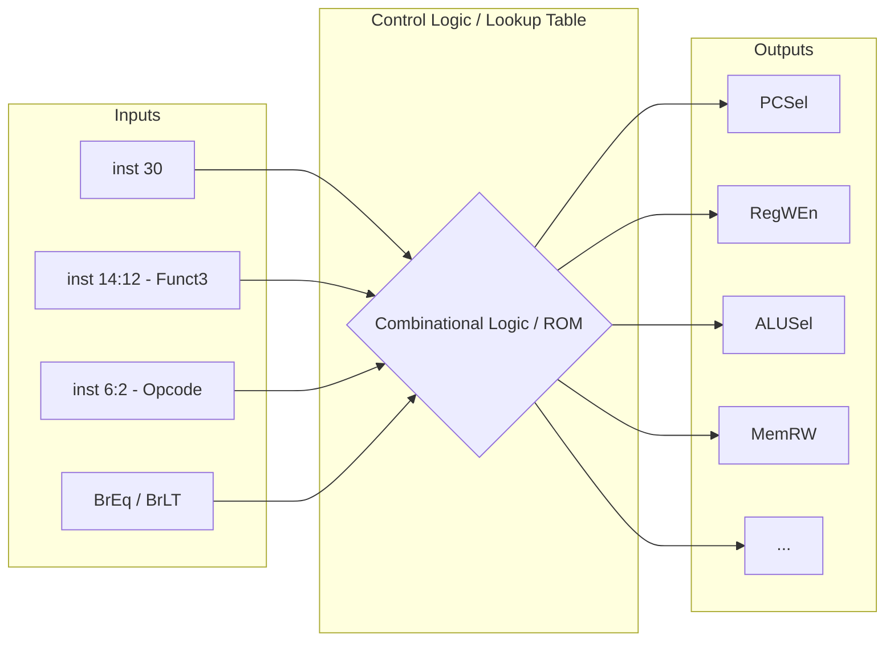

# UC Berkeley 61C - Lecture 20: Single-Cycle CPU Logic Control (单周期 CPU 控制逻辑) 总结

本章主要基于 UC Berkeley CS61C 第20讲的内容，详细分析了在单周期 RISC-V 处理器中如何实现“控制逻辑 (Logic Control)”。控制逻辑是 CPU 的“大脑”，它负责解析从指令内存中提取的机器指令，并为整个数据通路（Datapath）生成相匹配的操作与选择信号。

## 1. 控制逻辑 (Control Logic) 的核心作用

数据通路 (Datapath) 负责数据流的运算与传输，而 **控制逻辑 (Control Logic)** 决定了这套通路该具体进行“哪种操作”。
控制单元（Control Unit）将输入的 **32位指令** 截取其中的关键字段：
- **`opcode`** (指令操作码: bits [6:0])
- **`funct3`** (3位功能码: bits [14:12])
- **`funct7`** (7位功能码: bits [31:25])

基于这些字段，控制单元输出一系列开关信号（控制信号），驱动各类多路选择器 (MUX) 和功能组件如 ALU 或存储器。

## 2. 关键的控制信号 (Control Signals)

常见的控制信号（如截图中的真值表与原理图所示）分为几个主要的类别：

### MUX 选择控制 (Multiplexer Selection)
*   **`ALUSrc`**: 控制 ALU 第二个输入源。`0` 代表来自寄存器 (Register 2)，`1` 代表来自立即数生成器 (Imm Gen)。
*   **`MemtoReg`**: 控制写回寄存器堆的数据来源。`0` 代表来自 ALU 的计算结果，`1` 代表来自数据存储器 (Data Memory)。
*   **`PCSrc` (由 Branch 和 ALU 标志产生)**: 判断是否进行分支跳转。

### 读/写使能控制 (Read/Write Enables)
*   **`RegWrite`**: 寄存器堆写使能信号。`1` 代表允许将结果写入目标寄存器 (`rd`)。
*   **`MemRead`**: 数据存储器读使能信号。Load 指令专用。
*   **`MemWrite`**: 数据存储器写使能信号。Store 指令专用。

### 运算操作控制 (Operation Selection)
*   **`ALUOp`** / **ALU Control**: 决定 ALU 内部进行哪种运算（如加法 Add、减法 Sub、与 And、或 Or、小于置位 Slt 等）。

## 3. 两级控制架构 (Two-Level Control Structure)

为了简化复杂性，通常将控制逻辑划分为两级：

1.  **Main Control (主控制单元)**
    *   **输入**: 仅 `opcode` (bits [6:0])。
    *   **输出**: 大部分 MUX 和读写使能信号（ALUSrc, MemtoReg, RegWrite, MemRead, MemWrite, Branch），以及一个粗略的 **ALUOp**（如 2-bit 的信号，用来指示这是 Load/Store、Branch 还是 R-type 操作）。

2.  **ALU Control (ALU 控制单元)**
    *   **输入**: 主控制输出的 `ALUOp` 加上指令内的 `funct3` 和 `funct7`。
    *   **输出**: 最终送入 ALU 的 4-bit 实际操作信号。
    *   **优势**: 降低解码逻辑的耦合度和硬件设计的复杂度。

## 4. ROM 与真值表实现 (ROM implementation)

在截图中可以看到真值表 (Truth Table) 会将指令对应的控制信号列出：
*   **R-Format** (`add`, `sub` 等): RegWrite=1, ALUSrc=0, MemRead=0, MemWrite=0, MemtoReg=0。
*   **Load** (`lw` 等): RegWrite=1, ALUSrc=1, MemRead=1, MemWrite=0, MemtoReg=1。
*   **Store** (`sw` 等): RegWrite=0, ALUSrc=1, MemRead=0, MemWrite=1, MemtoReg=X (Don't Care)。
*   **Branch** (`beq` 等): RegWrite=0, ALUSrc=0, MemRead=0, MemWrite=0, Branch=1。

这些真值表逻辑可以直接通过只读存储器（ROM - Read Only Memory）或者组合逻辑门（AND/OR/Inverter）电路来实现，从而完成了从固化的 Software 到动态运行的 Hardware 的映射转换。

## 总结

第6章的内容成功将“指令集架构 (ISA)”与上一章的“数据通路 (Datapath)”缝合起来。通过控制逻辑的精密调度，单周期 CPU 能够在一个时钟周期内完整执行每一条不同格式的 RISC-V 指令，为后续学习流水线 (Pipelining) 打下了基础。

---

## 5. 深度复习要点补充 (Lecture 20 内容拆解)

温习 CS61C Lecture 20 的前半部分（从 CSR 到 Datapath Control 再到 Timing 分析），是理解现代处理器如何从“一堆乱麻的导线”变成“有序工作的逻辑”的关键。基于课程视频和图片案例，梳理以下深度复习要点：

### 5.1 控制与状态寄存器 (CSR) 的角色
在基础的 32 个通用寄存器之外，处理器需要一套“管理层”寄存器，即 CSR (Control and Status Registers) 。
*   **功能定位**：它们不直接参与日常的加减法运算，而是用于监控性能（如记录执行了多少个周期）、管理中断/异常以及与外设通信。
*   **指令格式**：CSR 指令通常共享 I-Type 格式，其中 12 位立即数部分被复用为 CSR 的地址，因此理论上支持 $2^{12} = 4096$ 个 CSR 寄存器。
*   **核心操作**：最典型的是 `csrrw`（原子读写），它会将 CSR 的旧值存入通用寄存器 `rd`，同时将 `rs1` 的值写入 CSR。

### 5.2 数据通路控制 (Datapath Control) 与并发
视频通过 `sw` 和 `beq` 两个案例，揭示了单周期 CPU 中并发执行的真相：虽然它是“单周期”，但内部许多动作是并行发生的 。

**案例 A：sw (Store Word) 指令流**
*   **启动**：在时钟上升沿，PC 更新并指向指令存储器。
*   **并发动作 1**：在计算 $PC + 4$ 的同时，CPU 已经在从指令存储器取出指令了。
*   **并发动作 2**：在控制单元（Control Unit）还在解码指令时，寄存器堆（Register File）已经开始读取数据（即使不知道需不需要这些数据，先读了再说，反正不花钱）。
*   **关键信号配置**：
    *   `RegWEn = 0`（因为 sw 不写回寄存器）。
    *   `ALUSel = Add`（计算基址 + 偏移量）。
    *   `MemRW = Write`。

**案例 B：beq (Branch if Equal) 指令流**
*   **逻辑挑战**：`pc_sel` 信号不能立刻确定。
*   **流程**：CPU 必须等待 Branch Comparator 的比较结果，同时等待 ALU 计算出跳转的目标地址。
*   **结果**：只有当比较结果出来后，`pc_sel` 才会告诉多路选择器是选择 $PC + 4$ 还是跳转地址，并在下一个时钟上升沿更新 PC。

### 5.3 指令时序与关键路径 (Instruction Timing)
这是 CPU 性能设计的核心。时钟频率不是拍脑袋定的，而是由最慢的那条指令决定的。

**关键路径分析**
指令的执行被细分为 5 个阶段：IF (取指)、ID (译码/读寄存器)、EX (执行/ALU)、MEM (访存)、WB (写回)。
*   `add` 指令：只需要 IF → ID → EX → WB（跳过了 MEM 阶段），总延迟较短（约 $600\text{ ps}$）。
*   `lw` (Load Word) 指令：必须经历完整的 5 个阶段。它既要算地址（EX），又要读内存（MEM），最后还要写回寄存器（WB），是典型的瓶颈指令。

**定量计算示例**
假设数据：
*   $T_{IF} = 200\text{ ps}$
*   $T_{ID} = 100\text{ ps}$
*   $T_{EX} = 200\text{ ps}$
*   $T_{MEM} = 200\text{ ps}$
*   $T_{WB} = 100\text{ ps}$（含建立时间 $T_{setup}$）

对于 `lw`，总延迟为：
$$T_{lw} = 200 + 100 + 200 + 200 + 100 = 800\text{ ps}$$
为了保证所有指令都能成功运行，时钟周期 $T_{clk}$ 必须大于等于 $800\text{ ps}$。因此，最大频率为：
$$f_{max} = \frac{1}{800\text{ ps}} = 1.25\text{ GHz}$$

*(温习思考题：在单周期 CPU 中，如果我们为了提升频率，强制把 $T_{clk}$ 设置为 $600\text{ ps}$，也就是 add 能跑完但 lw 跑不完的速度，处理器会发生什么具体的物理错误？)*

### 5.4 控制逻辑的深层实现：作为一张“查找表” (Lookup Table)
后半部分的核心在于：如何通过硬件自动生成这些信号？控制单元本质上是一个函数，它的输入是指令的特征位，输出是数据通路的开关信号。

**输入信号 (Inputs)**
为了区分 RISC-V 的各种指令，控制单元只需要观察 9 个 bits：
*   `inst[6:2]`：Opcode（指令类型，如 R-type, I-type）。
*   `inst[14:12]`：Funct3（子类型，如 add vs sll）。
*   `inst[30]`：Funct7 的一位（区分 add/sub 或 逻辑/算术移位）。
*   `BrEq`, `BrLT`：来自分支比较器的反馈信号（决定是否跳转）。

**输出信号 (Outputs)**
输出是 15+ 个控制位（如 `PCSel`, `RegWEn`, `ALUSel`, `MemRW` 等），它们共同决定了数据通路的“走线”方式。

### 5.5 物理实现细节：从真值表到逻辑门 (Gate Implementation)
在单周期设计中，组合逻辑的底层原理是将“指令的机器码”作为自变量，通过布尔代数运算，实时输出“控制信号”作为因变量。

**1. 底层原理：**
*   **确定输入特征位**：提取 Opcode, Funct3, inst[30]。
*   **建立真值表 (Truth Table)**：每行一种指令，每列一个控制信号。
*   **硬件映射**：使用 `AND` 门检测特定的位模式，使用 `OR` 门汇总信号。

**2. 公式推导案例：ADD 指令的解码公式**
根据 RISC-V 标准，ADD 的位模式是：Opcode `0110011` (R-type), Funct3 `000`, inst[30] `0`。
要设计一个电路只有当输入满足条件时输出 1（1用导线直连，0用非门反转后连与门）：
$$IsAdd = (inst_6 \cdot inst_5 \cdot \overline{inst_4} \cdot \overline{inst_3} \cdot inst_2) \cdot (\overline{inst_{14}} \cdot \overline{inst_{13}} \cdot \overline{inst_{12}}) \cdot \overline{inst_{30}}$$

如果我们要求出 `RegWEn` 的最终公式，则汇总所有写入寄存器的指令：
$$RegWEn = IsAdd + IsSub + IsLw + IsAddi + \dots$$

**3. 逻辑简化的艺术：**
在实际芯片设计中，工程师会尽可能简化公式以减少延迟和功耗。
例如区分指令逻辑右移 (`srl`) 和算术右移 (`sra`)，它们的 Opcode 和 Funct3 完全一样，唯一的区别是 `inst[30]`：SRL是0，SRA是1。
底层实现中，ALU 内部的移位器会直接接收 `inst[30]` 作为一个控制位进行补符号或补零操作，直接复用指令位，省掉了解码逻辑。

### 5.6 架构总结：软件与硬件的“历史性会面”
如课程所述，这是一个重大的里程碑：**You made contact.** (硬件遇见了软件)。
此时的单周期 CPU 已经是一个图灵完备的处理器，能运行编译出的任何 RV32I 代码。但它的致命弱点在于：
*   **性能极低**：由于必须等待最慢的指令（`lw`）跑完整个关键路径，时钟频率被卡死：$T_{cycle} \ge T_{IF} + T_{ID} + T_{EX} + T_{MEM} + T_{WB}$。
*   **资源浪费**：做简单的 add 时内存模块闲置；访存时 ALU 闲置。

这也直接引出了接下来的优化方向：**流水线 (Pipelining)**，让取指、执行、访存同时在不同的指令上进行。

*(巩固练习：假设设计支持 sub 指令，它和 add 的 Opcode、Funct3 完全一样。控制单元依靠哪个具体的 bit 区分它们？这个 bit 会直接改变哪一个控制信号？如果要增加一条全新的加密指令，需要在组合逻辑电路中修改哪些部分？)*
