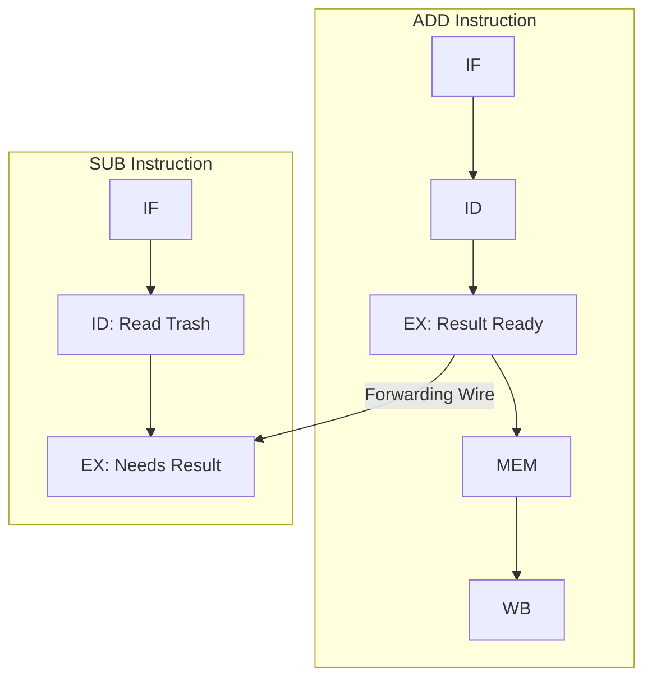

# 深入理解流水线设计 (三)：数据冒险与解决策略 (Data Hazards & Forwarding)

当指令之间存在数据依赖（Data Dependency）时，由于指令执行的延迟性，会导致数据冒险（Data Hazard）。这是流水线设计中最常遇到且必须用硬件精巧解决的问题。最常见的是 Read-After-Write (RAW) 冒险。

## 1. 原生数据冒险案例

观察以下汇编代码：
```assembly
add  x1, x2, x3   # 指令1: 将 x2+x3 的结果写入 x1
sub  x4, x1, x5   # 指令2: 需要读取 x1 的值
and  x6, x1, x7   # 指令3: 需要读取 x1 的值
```

**问题出现**：
在标准的 5 级流水线中，指令 1 (`add`) 只有在走到最后一级 **WB** 的时刻，才会把 `x1` 的最新值真正写入到 Register File 中。
而指令 2 (`sub`) 在其生命周期的第二阶段 **ID** 就需要去 Register File 读 `x1` 的值。
此时 `add` 才刚刚跑到 EX 阶段，还没有写回！指令 2 读到的绝对是一个历史遗留的旧垃圾数据。

## 2. 利剑出鞘：前递 / 旁路 (Forwarding / Bypassing)

我们可以不让指令 2 傻等吗？可以！
虽然指令 1 还没把结果写回 Register，但在它的 **EX 阶段（ALU计算完）** 结束后，真正的计算结果已经出现了！而且正躺在 `EX/MEM` 流水线寄存器里。

**硬件前递的核心思想**：
既然热乎的正确答案已经在 `EX/MEM` 甚至 `MEM/WB` 寄存器里了，我们就直接在硬件上拉一条新导线，把这个结果“短路 / 前递”回目前正在 EX 阶段的指令 2 的 ALU 输入端。



依靠增加前递 MUX 选择器，我们完美解决了单纯由 ALU 算术指令造成的数据冒险，流水线无需停顿！

## 3. 棘手的绝境：Load-Use Hazard

前递能解决所有数据冒险吗？不。遇到下面的情况前递也无能为力：

```assembly
lw   x1, 0(x2)    # 指令1: 从内存中读取数据存入 x1
add  x3, x1, x4   # 指令2: 紧接着就要使用 x1
```

**绝境分析**：
对于 `lw` 指令，真正拿到数据必须等到它的 **MEM 阶段** 结束。此时数据才刚刚从 D-Cache 拔出来。
但是，紧跟在它后面的 `add` 指令，在其 **EX 阶段** 就立刻需要这个数据（准备扔进 ALU 计算）。
按时间轴看：`add` 的 EX 阶段位于时间点 $T3$；而 `lw` 的 MEM 阶段完成位于时间点 $T4$。
我们无法让时间倒流（Data travels backwards in time is impossible）。

### 3.1 硬件解法：流水线停顿 (Stall / Bubble)

唯一的物理解决办法是：硬件在 ID 阶段检测到了这种 `Load-Use` 依赖，自动强制后续指令在原地“停一拍”。

1.  硬件将 `add` 指令在 ID 阶段暂停。
2.  为了不让更后面的指令追尾，连带 `add` 后面的所有指令统统停一拍。
3.  在 EX 阶段硬件主动塞入一个特殊的无害指令（`NOP` 操作），称为 **气泡 (Bubble)**。
4.  等到 `lw` 走完 MEM 阶段拿到数据后，再通过**前递**通道把数据传给等了一拍的 `add`。

### 3.2 软件解法：编译器指令调度 (Instruction Scheduling)

流水线一停顿，那一拍什么有效工作都没做，CPI (Cycles Per Instruction) 就会下降，性能受损。
聪明的软件（如 GCC / LLVM 编译器）可以通过**重新排列汇编指令的顺序 (Code Reordering)** 来掩盖这个延迟！

原代码（有 Load-Use 停顿）：
```c
A = B + C;
D = E - F;
```
汇编：
```assembly
lw x1, B
lw x2, C
add x3, x1, x2  // 依赖前两句，发生 Stall!
sw x3, A

lw x4, E
lw x5, F
sub x6, x4, x5  // 依赖前两句，发生 Stall!
sw x6, D
```

**编译器优化的汇编（消除 Stall）：**
```assembly
lw x1, B
lw x2, C
lw x4, E        // 将下面互相无关的取数指令提前塞进来，填补时间差！
lw x5, F

add x3, x1, x2  // 此时 x1, x2 早已在这两拍空隙中完成了读取，无需 Stall！
sw x3, A
sub x6, x4, x5  // 同样无需 Stall
sw x6, D
```
因此，**理解硬件流水线不仅是芯片设计师的事情，底层编译器开发者也必须熟练掌握架构规律，才能榨干处理器的极致性能！**