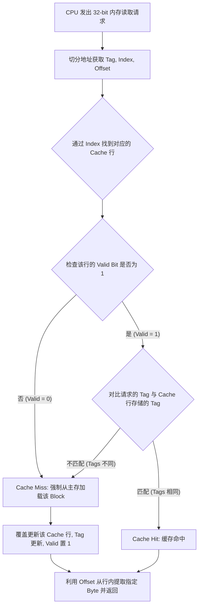
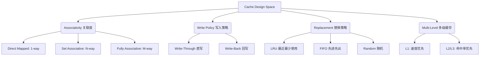

攻克 CS61C 的 Caches 章节是一次硬核的系统级拔高。掌握了这部分，以后在打比赛刷 CSES 算法题，或者写 Rust 处理底层内存和生命周期时，你就能从硬件的维度理解为什么连续数组的遍历比随机访问快得多（这就是空间局部性的威力）。

关于我在上一轮展示的交互式小组件，由于它是平台内部渲染的 UI 模块，我无法直接向你输出可以运行的独立应用组件。不过，为了让你能在本地复现和随时推演，我用原生 HTML/JS/CSS 为你写了一份**单文件可视化计算器代码**。你可以将其保存为 `cache_calc.html` 并在浏览器中直接打开。

### 一、 T.I.O 可视化计算器代码 (HTML/JS)
见同目录下代码
---

### 二、 CS61C 缓存知识架构总结 (Markdown)

下面为你整理的一份结构化笔记，涵盖了公式、概念与推演逻辑。

# CS61C: Caches I & II 核心知识架构

## 1. 为什么需要 Cache？(核心动机)
[cite_start]计算机发展史上，CPU 性能以每年 55% 的极高速度增长，而 DRAM（主存）的访问速度每年仅提升 7%，导致两者之间产生了巨大的“性能鸿沟” [cite: 233][cite_start]。如果直接让 CPU 读写主存，CPU 可能会为了等待数据而空转上千个时钟周期 [cite: 234]。

[cite_start]引入 Cache 的本质是为了创造一个**硬件抽象**：让程序拥有如同底层磁盘般庞大的容量，同时享有如同顶层寄存器般迅捷的访问速度 [cite: 189, 222]。

## 2. 局部性原理 (Locality)
Cache 机制之所以能生效，完全依赖于程序的两种行为特征：
* [cite_start]**时间局部性 (Temporal Locality)**：如果一个数据项刚刚被访问过，那么它在近期极有可能被再次访问 [cite: 198]。
    * [cite_start]*应对策略*：Cache 默认会将最近从主存抓取的数据副本保留在内部 [cite: 202]。
* [cite_start]**空间局部性 (Spatial Locality)**：如果一个数据项被访问，那么与它地址相邻的数据项在近期也很可能被访问 [cite: 200, 201]。
    * [cite_start]*应对策略*：主存与 Cache 之间的数据搬运不以 Byte 为单位，而是以 **Block（数据块）**为单位，一次性搬运相邻的一批数据 [cite: 204]。

## 3. 二进制前缀与容量速算
[cite_start]Dan 教授提供了一个极度实用的 $2^{xy}$ 速算法，其中 $x$ 代表十位，$y$ 代表个位 [cite: 17]：
* [cite_start]**个位 $y$** 决定基础数值：$2^4 = 16, 2^6 = 64, 2^9 = 512$ [cite: 17]。
* [cite_start]**十位 $x$** 决定量级前缀：$0$ = 纯数字, $1$ = Kibi, $2$ = Mebi, $3$ = Gibi, $4$ = Tebi [cite: 18, 19]。
    * [cite_start]*示例*：计算 32 KiB 的总位数。32 是 $2^5$，Ki 对应 $2^{10}$，所以总和为 $2^{15}$，即 15 bits [cite: 122, 123]。

## 4. 直接映射缓存 (Direct Mapped Cache)
[cite_start]在直接映射缓存中，内存中的每个地址都会被强制绑定到 Cache 中的**唯一一个固定 Block 槽位** [cite: 64, 65][cite_start]。为了让硬件控制器知道如何拆解地址，我们需要用到 **T.I.O 模型** [cite: 118]：

$$\text{Total Cache Size} = \text{Number of Blocks} \times \text{Block Size}$$

| 字段名称 | 作用说明 | 公式推导 |
| :--- | :--- | :--- |
| **Offset (O)** | [cite_start]确定目标 Byte 在加载进来的 Block 中的哪一列 [cite: 115]。 | $$\text{Offset} = \log_2(\text{Block Size in Bytes})$$ |
| **Index (I)** | [cite_start]确定目标内存块应该放置在 Cache 的哪一行 [cite: 114]。 | $$\text{Index} = \log_2(\frac{\text{Total Cache Size}}{\text{Block Size}})$$ |
| **Tag (T)** | [cite_start]用于比对当前 Cache 行中存放的副本，是否真的是我们请求的那个高位地址区块 [cite: 112, 115]。 | $$\text{Tag} = \text{Address Size} - \text{Index} - \text{Offset}$$ |

> [cite_start]**关键机制 - Valid Bit (有效位)**：Cache 刚通电时全是随机垃圾数据（Cold Cache）。为了区分“垃圾数据”和“真实数据”，Cache 的每一行额外增加了一个 Valid Bit。仅当数据真正从主存加载进来后，该位才置为 1 [cite: 146, 147]。

## 5. 缓存访问控制流 (Cache Controller Flow)
[cite_start]当 CPU 发出一个内存读取请求时，硬件控制器（Cache Controller）会完全透明地执行以下流程（无需修改任何软件代码） [cite: 217, 218]：



## 6. 核心术语 (Terminology)
* [cite_start]**Cache Hit (命中)**：在 Cache 中找到了需要的数据（且 Tag 匹配，Valid 为 1） [cite: 133]。
* [cite_start]**Cache Miss (未命中)**：数据不在 Cache 中，或存放的是别人的数据（发生冲突），需要付出前往底层的 **Miss Penalty (未命中惩罚)** [cite: 133, 142]。
* **Cache 温度**：
    * [cite_start]**Cold (冷)**：Cache 全空，所有 Valid bit 都为 0 [cite: 136, 150]。
    * [cite_start]**Warm (暖)**：随着程序执行，Cache 被部分填充，开始出现命中 [cite: 138]。
    * [cite_start]**Hot (热)**：程序陷入紧凑循环，极高频地命中 Cache [cite: 139]。

## 7. 典型案例实战分析
[cite_start]**案例条件**：32-bit 架构，Cache 容量 8 Bytes，Block 容量 2 Bytes [cite: 24, 25]。

**T.I.O 计算逻辑**：
1. [cite_start]**O (Offset)**：Block = 2 Bytes，需要区分块内的 2 个位置 $\rightarrow$ $\log_2(2) = 1$ bit [cite: 26]。
2. [cite_start]**I (Index)**：Cache 总行数 = 8 Bytes / 2 Bytes = 4 行。需要区分 4 个行位 $\rightarrow$ $\log_2(4) = 2$ bits [cite: 27]。
3. [cite_start]**T (Tag)**：剩下的高位全部分配给 Tag $\rightarrow$ $32 - 1 - 2 = 29$ bits [cite: 29]。

**寻址映射规则**：
* [cite_start]内存地址 `0x00000000` 到 `0x00000001` 被打包为 Block 0，映射到 Cache 的 Index `00` [cite: 43, 87]。
* [cite_start]内存地址 `0x00000002` 到 `0x00000003` 被打包为 Block 1，映射到 Cache 的 Index `01` [cite: 87]。
* 这种映射严格遵循取模逻辑：只要目标地址的 Index bits 相同，它们就会在这个直接映射缓存中互相竞争（覆盖）同一个槽位。


这份总结将作为你 `Caches` 这一章的核心索引（README）。我按照逻辑递进的关系，将 Section III 和 IV 的知识点提炼成了结构化的目录，你可以直接将它复制到你的笔记软件（如 Notion、Obsidian 或 Markdown 文件）中。

---

# 📂[CS61C] Cache 架构与设计哲学：从单级理论到多级现实
**涵盖内容：** Section III (全相联、设计权衡、3C模型) & Section IV (组相联、替换策略、多级缓存)

## 📁 01. 核心寻址与架构演进 (Associativity Architecture)
*本模块探讨：内存地址如何映射到 Cache，以及解决“抢座冲突”的三种架构演进。*

*   **📄 1.1 直接映射 (Direct-Mapped - 极左端)**
    *   **规则：** `地址 = Tag | Index | Offset`。必须按尾号（Index）入座。
    *   **优劣：** 硬件极其简单便宜；但极易发生“乒乓效应”，产生大量冲突未命中。
*   **📄 1.2 全相联 (Fully Associative - 极右端)**
    *   **规则：** `地址 = Tag | Offset`。砍掉 Index，有空位随便坐。
    *   **优劣：** 彻底消灭冲突未命中；但读取时需要数以万计的并行比较器（Comparators），硬件造价昂贵，在 L1/L2 中不可行（仅用于 TLB 等微小组件）。
*   **📄 1.3 组相联 (N-Way Set Associative - 完美折中)**
    *   **规则：** `地址 = Tag | Index | Offset`。Index 决定进哪个“包厢(Set)”，进了包厢后，包厢内的 N 个座位“随便坐”（局部全相联）。
    *   **优势：** 现代 CPU 的标配（如 8-Way）。用极小的硬件代价（只需 N 个并行比较器和 MUX），避免了绝大多数冲突。

## 📁 02. Miss 分类学：3C 诊断模型 (Types of Misses)
*本模块探讨：当缓存未命中时，如何像医生一样精准归因（基于 Prof. Kubiatowicz 的思想实验）。*

*   **🔍 1st C: 强制未命中 (Compulsory Miss)**
    *   **定义：** “冷启动”。第一次访问该数据，连“无限大+全相联”的完美缓存也救不了。
*   **🔍 2nd C: 容量未命中 (Capacity Miss)**
    *   **定义：** 缓存真的装满了。在“全相联”超能力下依然发生的 Miss，纯粹是因为程序工作集大于缓存总容量。
*   **🔍 3rd C: 冲突未命中 (Conflict Miss)**
    *   **定义：** 运气太差撞车了。缓存还有空位，但因为直接映射/低相联度，多个块抢同一个 Index 而互相驱逐。
    *   *(隐藏的 4th C: Coherence Miss 一致性未命中，多核并发引发，后续课程探讨)*

## 📁 03. 缓存设计的四大权衡 (The Four Design Trade-offs)
*本模块探讨：架构师手中的四根“画笔”，如何平衡速度、容量与造价。*

*   **⚖️ 权衡 1: 块大小 (Block Size)**
    *   **调优目标：** 寻找 AMAT 曲线的“U型谷底”（现代通常为 64 Bytes）。
    *   **变大好处：** 利用空间局部性，一次搬进更多相邻数据，降低 Miss Rate。
    *   **变大代价：** 增大 Miss Penalty（搬运变慢）；减少了缓存总行数，可能引发乒乓效应。
*   **⚖️ 权衡 2: 写入策略 (Write Policy)**
    *   **Write-Through (直写)：** 写 Cache 同时写主存。安全但极慢。
    *   **Write-Back (回写)：** 只写 Cache，标上 `Dirty Bit (脏位)`。只有当该块被**踢出**时才写回主存。现代系统标配，极大地利用了时间局部性。
*   **⚖️ 权衡 3: 相联度 (Associativity)** 
    *   Direct-Mapped vs. N-Way vs. Fully Associative （见目录 01）。
*   **⚖️ 权衡 4: 替换策略 (Block Replacement Policy)**
    *   *当包厢满时踢谁？*
    *   **LRU (最近最少使用)：** 踢掉最久没被访问的。符合时间局部性，命中率高，但高相联度下硬件追踪极难。
    *   **FIFO (先进先出)：** 踢掉最早进来的。简单但无视局部性。
    *   **Random (随机)：** 闭眼乱踢。造价低，对于无明显局部性的程序效果不比 LRU 差。

## 📁 04. 性能金标准与多级缓冲 (Performance & Multi-Level Hierarchy)
*本模块探讨：如何用数学公式衡量系统性能，以及解决现代 CPU 内存墙危机。*

*   **🧮 核心公式：平均内存访问时间 (AMAT)**
    *   `AMAT = Hit Time + (Miss Rate × Miss Penalty)`
*   **🏰 嵌套魔法：多级缓存 (L1/L2/L3)**
    *   **痛点：** 现代处理器跑去主存（DRAM）受罚太痛（>200个周期，“去萨克拉门托之旅”）。
    *   **解法：** 在 L1 和主存间插入 L2。L2 的使命不是极速，而是**拦截**（抓取刺头数据），极大降低 L1 的 Miss Penalty。
    *   **嵌套计算套路：** 将 L2 的 AMAT 公式，整体代入 L1 的 `Miss Penalty` 中。

## 📁 05. 物理现实与底层细节 (Hardware & Physical Reality)
*本模块探讨：纸上谈兵的理论，在真实的晶体管和硅片上长什么样。*

*   **🔌 硬件寻址精要：**
    *   **Byte Offset 高位拦截：** 针对 4-Word Block，忽略二进制末尾的 `00`，用高位控制多路复用器 (MUX) 精准提取具体的 Word。
    *   **One-Hot 独热码电路：** 组相联内部并行比较 Tag 时，多个 AND 门最终只会有一个输出为 1，直接驱动 MUX 开关。
*   **🔬 真实 CPU 切片 (Die Shots)：**
    *   为了防止流水线结构冲突，L1 在物理上被拆分为 **L1-I (指令)** 和 **L1-D (数据)**。
    *   现代多核处理器架构：L1/L2 为单核私有（紧贴核心保障极速），L3 为多核共享（占地面积极大，方便核心间通信）。

## 💡 06. 架构师的终极思想 (Great Ideas)
1.  **缓存无处不在 (Caching is everywhere)：** 只要某事代价高昂且需重复做，就缓存结果（Memoization, Redis, 浏览器缓存）。
2.  **机械同理心 (Mechanical Sympathy)：** 懂底层的程序员，才会写出 `按行遍历数组` 这种对 Cache 友好的高性能代码。
3.  **创造终极幻觉 (The Illusion)：** 架构师利用极其简单的物理逻辑（Tag 比对、Dirty Bit、LRU），结合数学概率（局部性原理），最终让 CPU 产生了一个“内存既无限大，又光速运行”的完美幻觉。

---
*(使用指南：在复习刷题时，遇到地址划分去查[01]；遇到让你算周期的嵌套题去查 [04]；遇到判断未命中类型的文字题去查 [02]；遇到画图推演 LRU 的去查 [03]。)*


太棒了！CS61C 的 Cache（缓存）章节是整个计算机体系结构中最核心、也最精妙的设计之一。后半部分（Lecture 26.1 - 27.4）从最初简单的直接映射（Direct Mapped）缓存，逐步剥洋葱式地引入了真实 CPU 必须面对的复杂性：冲突、写入策略、替换策略以及多级缓存的性能量化。

为了让你更直观地理解底层的硬件逻辑，我为你准备了视觉化的流程图来梳理核心机制。以下是这 6 节课的知识内容分析、整体架构以及重难点解析。

### 一、 整体架构

后半部分的课程实际上是围绕着“如何设计一个命中率更高、代价更小的缓存层”这一核心命题展开的。它主要探讨了以下四个维度的设计权衡（Trade-offs）：



---

### 二、 核心知识内容分解

#### 1. 缓存关联度 (Associativity) 的演进

* 
**直接映射 (Direct Mapped):** 每个内存块只能映射到缓存中的唯一一个固定行（Row/Index） 。实现极其简单，但极易发生**冲突未命中 (Conflict Miss)**，比如在复制数组时，两个不同的内存块如果映射到同一个 Index，就会出现灾难性的“乒乓效应 (Ping-pong effect)”，互相将对方踢出 。


* 
**全相联 (Fully Associative):** 内存块可以存放在缓存的**任何**位置 。地址被划分为 Tag 和 Offset，**没有 Index** 。这彻底消除了冲突未命中 ，但硬件代价极大：每次查找需要成千上万的硬件比较器 (Comparators) 并行工作，这在真实 CPU 的 L1 Cache 中是不可行的 。


* 
**组相联 (Set Associative):** “折中”的艺术。将缓存分为多个 Set（组），每个 Set 内包含 N 个 Block（N-way） 。Index 决定你去哪个组，进入该组后，组内的 N 个元素进行全相联比较 。它用有限的硬件比较器（比如 4 个或 8 个）极大地缓解了冲突未命中 。


#### 2. 处理写入操作 (Handling Writes)

* 
**Write-Through (直写):** 每次写入缓存时，同时将数据同步写入下一级内存（即视频中的老梗 "Sacramento"） 。优点是内存和缓存始终保持一致，缺点是极度拖慢性能 。


* 
**Write-Back (回写):** 写入操作仅在缓存中进行。我们引入一个 **Dirty Bit（脏位）**，当缓存块被修改时，将其标记为 1，此时内存中的数据变为了“旧数据 (Stale)” 。只有当这个被修改过的缓存块**即将被踢出 (Evicted)** 或缓存被清空时，才将其写回内存 。这极大地利用了时间局部性，大幅减少了访问主存的次数 。


#### 3. 块替换策略 (Block Replacement)

当一个 Set 满了，必须踢出一个人才能装入新数据时，该踢谁 ？

* 
**LRU (Least Recently Used):** 踢出最久未使用的块，完美契合时间局部性 。2-way 的 LRU 极其简单，只需要 1 个 bit 就能记录谁是最近使用的 。但对于 8-way，需要追踪状态的排列组合($8!$)，硬件实现极难 。


* 
**FIFO (先进先出):** 像队列一样，不管你中途被访问了多少次，按进入缓存的顺序排队被踢出 。忽略了时间局部性 。


* 
**Random (随机):** 随机踢出。实现成本极低，且在某些特定访问模式下，性能并不比 LRU 差多少 。


#### 4. 平均内存访问时间 (AMAT)

性能优化的核心指标。无论命中与否，只要你发起了访问，Hit Time 是必须支付的固定成本 。


$$AMAT = \text{Hit Time} + \text{Miss Rate} \times \text{Miss Penalty}$$

* 
**多级缓存嵌套:** 引入 L2 缓存就是为了降低 L1 的 Miss Penalty（去主存的巨大代价） 。


$$AMAT = L1_{Hit Time} + L1_{Miss Rate} \times (L2_{Hit Time} + L2_{Miss Rate} \times L2_{Miss Penalty})$$


---

### 三、 重难点解析：3C 未命中与缓存读写流

#### 难点 1：如何区分 3C Misses？

分析程序的性能瓶颈，关键在于识别你遇到了哪种类型的未命中 (Miss)：

1. 
**Compulsory (强制性未命中/冷启动):** 第一次访问某个内存地址必然未命中。Valid bit 为 0 。即使缓存是无限大的，也会发生 。


2. 
**Capacity (容量未命中):** 你的程序工作集（Working Set）大于缓存的总容量 。如果把缓存变成无限大的全相联，这些 Miss 就会消失 。


3. 
**Conflict (冲突未命中):** 缓存其实还有空位，但是因为你的地址不幸地映射到了同一个已经满了的 Set，导致互相驱逐 。如果你增加关联度（比如从直接映射改为全相联），这类 Miss 就会消失 。


极端反例：如果你编写程序遍历一个数组，且每次跳跃的步长 (Stride) 等于缓存总大小，你将遭遇灾难性的未命中，所有的空间局部性都失效了 。

#### 难点 2：Write-Back 策略下的完整生命周期 (Visual Flow)

理解带脏位 (Dirty Bit) 的 Set-Associative Cache 的硬件处理逻辑，是 CS61C 考试中最常考的知识点。你可以通过以下硬件逻辑流来加深理解：

```mermaid
flowchart TD
    Start([CPU发起内存读/写请求]) --> Split[拆分地址: Tag | Index | Offset]
    Split --> GoSet[根据 Index 找到对应的 Set]
    GoSet --> CheckHit{并行比较 Set 内所有块: \n Valid == 1 且 Tag 匹配?}
    
    CheckHit -- Yes (Cache Hit) --> TypeHit{操作类型?}
    TypeHit -- Read --> RetData[根据 Offset 返回数据字]
    TypeHit -- Write --> SetDirty[写入数据, 标记 Dirty Bit = 1]
    
    CheckHit -- No (Cache Miss) --> CheckFull{Set 里有空位吗? \n Valid == 0}
    
    CheckFull -- Yes --> FetchMem[从下一级内存抓取数据块填入]
    CheckFull -- No --> PickVictim[根据 LRU/Random 选中被踢出块 Victim]
    
    PickVictim --> IsDirty{Victim 的 Dirty Bit == 1 ?}
    IsDirty -- Yes --> WriteSacramento[将 Victim 写回下一级内存 'Sacramento']
    IsDirty -- No --> DropVictim[直接丢弃 Victim]
    
    WriteSacramento --> FetchMem
    DropVictim --> FetchMem
    
    FetchMem --> UpdateTag[更新 Valid=1, 填入新 Tag, 清除 Dirty Bit]
    UpdateTag --> TypeMiss{操作类型?}
    
    TypeMiss -- Read --> RetData
    TypeMiss -- Write --> SetDirty

```

### 四、 真实世界的收尾 (Actual CPUs)

现代真实的 CPU 不仅仅停留在理论：

* 为了防止取指令（Instruction Fetch）和读写数据（Data Load/Store）发生冲突，L1 缓存通常在物理上拆分为 **L1-I (Instruction)** 和 **L1-D (Data)** 。


* 现代多核处理器（如 Intel Core i7）中，每个核心拥有自己独立的 L1 和 L2 缓存，而 L3 缓存则是所有核心共享的 。


* 缓存的思想无处不在，无论是软件级别的记忆化 (Memoization)、Web 页面缓存、还是文件系统缓存，本质上都在运用这几节课所讲的利用局部性原理避免“长途跋涉 (Trip to Sacramento)” 。