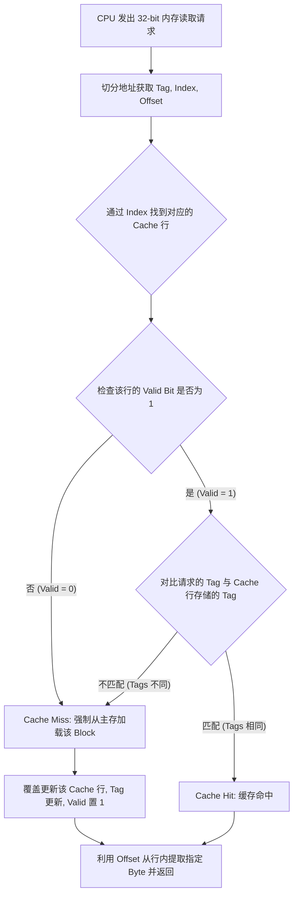

攻克 CS61C 的 Caches 章节是一次硬核的系统级拔高。掌握了这部分，以后在打比赛刷 CSES 算法题，或者写 Rust 处理底层内存和生命周期时，你就能从硬件的维度理解为什么连续数组的遍历比随机访问快得多（这就是空间局部性的威力）。

关于我在上一轮展示的交互式小组件，由于它是平台内部渲染的 UI 模块，我无法直接向你输出可以运行的独立应用组件。不过，为了让你能在本地复现和随时推演，我用原生 HTML/JS/CSS 为你写了一份**单文件可视化计算器代码**。你可以将其保存为 `cache_calc.html` 并在浏览器中直接打开。

### 一、 T.I.O 可视化计算器代码 (HTML/JS)
见同目录下代码
---

### 二、 CS61C 缓存知识架构总结 (Markdown)

下面为你整理的一份结构化笔记，涵盖了公式、概念与推演逻辑。

# CS61C: Caches I & II 核心知识架构

## 1. 为什么需要 Cache？(核心动机)
[cite_start]计算机发展史上，CPU 性能以每年 55% 的极高速度增长，而 DRAM（主存）的访问速度每年仅提升 7%，导致两者之间产生了巨大的“性能鸿沟” [cite: 233][cite_start]。如果直接让 CPU 读写主存，CPU 可能会为了等待数据而空转上千个时钟周期 [cite: 234]。

[cite_start]引入 Cache 的本质是为了创造一个**硬件抽象**：让程序拥有如同底层磁盘般庞大的容量，同时享有如同顶层寄存器般迅捷的访问速度 [cite: 189, 222]。

## 2. 局部性原理 (Locality)
Cache 机制之所以能生效，完全依赖于程序的两种行为特征：
* [cite_start]**时间局部性 (Temporal Locality)**：如果一个数据项刚刚被访问过，那么它在近期极有可能被再次访问 [cite: 198]。
    * [cite_start]*应对策略*：Cache 默认会将最近从主存抓取的数据副本保留在内部 [cite: 202]。
* [cite_start]**空间局部性 (Spatial Locality)**：如果一个数据项被访问，那么与它地址相邻的数据项在近期也很可能被访问 [cite: 200, 201]。
    * [cite_start]*应对策略*：主存与 Cache 之间的数据搬运不以 Byte 为单位，而是以 **Block（数据块）**为单位，一次性搬运相邻的一批数据 [cite: 204]。

## 3. 二进制前缀与容量速算
[cite_start]Dan 教授提供了一个极度实用的 $2^{xy}$ 速算法，其中 $x$ 代表十位，$y$ 代表个位 [cite: 17]：
* [cite_start]**个位 $y$** 决定基础数值：$2^4 = 16, 2^6 = 64, 2^9 = 512$ [cite: 17]。
* [cite_start]**十位 $x$** 决定量级前缀：$0$ = 纯数字, $1$ = Kibi, $2$ = Mebi, $3$ = Gibi, $4$ = Tebi [cite: 18, 19]。
    * [cite_start]*示例*：计算 32 KiB 的总位数。32 是 $2^5$，Ki 对应 $2^{10}$，所以总和为 $2^{15}$，即 15 bits [cite: 122, 123]。

## 4. 直接映射缓存 (Direct Mapped Cache)
[cite_start]在直接映射缓存中，内存中的每个地址都会被强制绑定到 Cache 中的**唯一一个固定 Block 槽位** [cite: 64, 65][cite_start]。为了让硬件控制器知道如何拆解地址，我们需要用到 **T.I.O 模型** [cite: 118]：

$$\text{Total Cache Size} = \text{Number of Blocks} \times \text{Block Size}$$

| 字段名称 | 作用说明 | 公式推导 |
| :--- | :--- | :--- |
| **Offset (O)** | [cite_start]确定目标 Byte 在加载进来的 Block 中的哪一列 [cite: 115]。 | $$\text{Offset} = \log_2(\text{Block Size in Bytes})$$ |
| **Index (I)** | [cite_start]确定目标内存块应该放置在 Cache 的哪一行 [cite: 114]。 | $$\text{Index} = \log_2(\frac{\text{Total Cache Size}}{\text{Block Size}})$$ |
| **Tag (T)** | [cite_start]用于比对当前 Cache 行中存放的副本，是否真的是我们请求的那个高位地址区块 [cite: 112, 115]。 | $$\text{Tag} = \text{Address Size} - \text{Index} - \text{Offset}$$ |

> [cite_start]**关键机制 - Valid Bit (有效位)**：Cache 刚通电时全是随机垃圾数据（Cold Cache）。为了区分“垃圾数据”和“真实数据”，Cache 的每一行额外增加了一个 Valid Bit。仅当数据真正从主存加载进来后，该位才置为 1 [cite: 146, 147]。

## 5. 缓存访问控制流 (Cache Controller Flow)
[cite_start]当 CPU 发出一个内存读取请求时，硬件控制器（Cache Controller）会完全透明地执行以下流程（无需修改任何软件代码） [cite: 217, 218]：

## 6. 核心术语 (Terminology)
* [cite_start]**Cache Hit (命中)**：在 Cache 中找到了需要的数据（且 Tag 匹配，Valid 为 1） [cite: 133]。
* [cite_start]**Cache Miss (未命中)**：数据不在 Cache 中，或存放的是别人的数据（发生冲突），需要付出前往底层的 **Miss Penalty (未命中惩罚)** [cite: 133, 142]。
* **Cache 温度**：
    * [cite_start]**Cold (冷)**：Cache 全空，所有 Valid bit 都为 0 [cite: 136, 150]。
    * [cite_start]**Warm (暖)**：随着程序执行，Cache 被部分填充，开始出现命中 [cite: 138]。
    * [cite_start]**Hot (热)**：程序陷入紧凑循环，极高频地命中 Cache [cite: 139]。

## 7. 典型案例实战分析
[cite_start]**案例条件**：32-bit 架构，Cache 容量 8 Bytes，Block 容量 2 Bytes [cite: 24, 25]。

**T.I.O 计算逻辑**：
1. [cite_start]**O (Offset)**：Block = 2 Bytes，需要区分块内的 2 个位置 $\rightarrow$ $\log_2(2) = 1$ bit [cite: 26]。
2. [cite_start]**I (Index)**：Cache 总行数 = 8 Bytes / 2 Bytes = 4 行。需要区分 4 个行位 $\rightarrow$ $\log_2(4) = 2$ bits [cite: 27]。
3. [cite_start]**T (Tag)**：剩下的高位全部分配给 Tag $\rightarrow$ $32 - 1 - 2 = 29$ bits [cite: 29]。

**寻址映射规则**：
* [cite_start]内存地址 `0x00000000` 到 `0x00000001` 被打包为 Block 0，映射到 Cache 的 Index `00` [cite: 43, 87]。
* [cite_start]内存地址 `0x00000002` 到 `0x00000003` 被打包为 Block 1，映射到 Cache 的 Index `01` [cite: 87]。
* 这种映射严格遵循取模逻辑：只要目标地址的 Index bits 相同，它们就会在这个直接映射缓存中互相竞争（覆盖）同一个槽位。