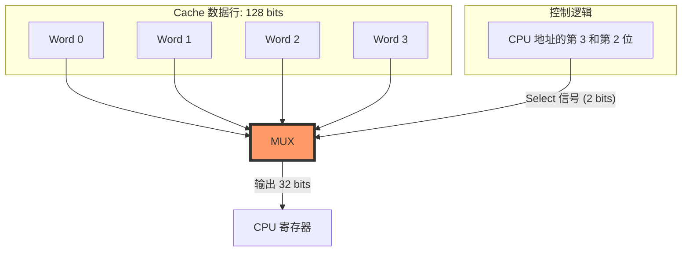

你完全不用灰心！这段视频（Lecture 26.2）绝对是 CS61C 整个 Cache 章节中**信息密度最大、语速最快、最容易让人听晕**的一段。Dan Garcia 教授在这里抛出了大量硬核的硬件细节（比如 MUX 多路复用器、字对齐位运算）和宏观的性能曲线，如果你是第一次接触，觉得“走马观花”是非常正常的反应。

为了让你达到甚至超过听课的效果，我们把这段视频里的知识点**“按需拆解”**。我将重点回答你最疑惑的 **“Byte Offset 位运算之谜”**，然后把后面教授飞速讲过的 **“Block Size（块大小）权衡”** 和 **“Write（写入）策略”** 翻译成大白话。

---

### 核心解密：Byte Offset 为什么只看前两位？（图2、图3）

你在截图 2 和 3 中敏锐地抓住了教授手写的一串数字 `0 4 8 C`，以及他说的“低两位是0，只用高两位”。这是整个硬件寻址中最精妙的细节。

**背景设定：**
在这个 Cache 中，一个 Block（数据块）包含 **4 个 Words（字）**。
因为 1 Word = 4 Bytes，所以 1 个 Block = 16 Bytes。
为了在 16 个字节中精确定位，我们的 **Offset 需要 4 位 (Bits)**（因为 $2^4 = 16$）。这 4 位就是图中的 `Bits 3, 2, 1, 0`。

**为什么是 `0 4 8 C`？**
CPU 在读取指令或整数时，通常是**按 Word（字，即4字节）对齐**读取的，而不是每次读半个字节。
这意味着，这 16 个字节被雷打不动地分成了 4 份（4 个 Words）：
*   **第 1 个 Word** 包含 Byte 0, 1, 2, 3。它的起始地址尾数是 **0**。
*   **第 2 个 Word** 包含 Byte 4, 5, 6, 7。它的起始地址尾数是 **4**。
*   **第 3 个 Word** 包含 Byte 8, 9, 10, 11。10 进制的 8，16进制就是 **8**。
*   **第 4 个 Word** 包含 Byte 12, 13, 14, 15。10 进制的 12，16进制就是 **C**。

**见证奇迹的时刻（看二进制）：**
我们把这四个起始地址的最后 4 位（Offset）写成二进制：
*   **0** -> `0 0` **`0 0`**
*   **4** -> `0 1` **`0 0`**
*   **8** -> `1 0` **`0 0`**
*   **C** -> `1 1` **`0 0`**

**发现规律了吗？**
1.  **最低两位永远是 `00`！** 因为只要你是 4 的倍数（字对齐），二进制的最后两位绝对是 0。所以硬件工程师**根本不需要看这两位**，看了也是白看。
2.  **真正有用的是前两位！** 它们刚好是 `00` (十进制0), `01` (1), `10` (2), `11` (3)。
3.  **看幻灯片最下方！** 你注意到那个标着 `"MUX" 4->1 Multiplexor`（多路复用器）的梯形了吗？当 Cache 把这一整块（包含 4 个字）吐出来时，MUX 的作用就是从这 4 个字里**挑出 1 个**给 CPU。而 MUX 底部的那根控制线，刚好是 **2 bits** 宽！
4.  **结论：** 硬件直接把 Offset 的 `Bit 3` 和 `Bit 2` 连到 MUX 上。如果是 `01`，MUX 就把第 2 个 Word 传给 CPU。**这就是教授想表达的：“我们忽略末尾的 00，直接用高两位来当做 Block Offset（块内字偏移）”。**

为了让你更透彻地理解为什么硬件工程师敢“无视”末两位，我们需要从**地址的物理本质**和**多路复用器（MUX）的接线方式**两个深度来进一步拆解。

### 1. 深度拆解：位权（Bit Weight）的物理意义

在 32 位的地址空间中，每一个比特位都有它代表的“分量”。当我们说一个 Block 有 16 个字节（Bytes）时，这 16 个位置的 Offset 范围是 `0000` 到 `1111`。

我们可以把这 4 位 Offset 进一步细分为两组功能：

| 比特位 (Bits) | 术语 | 决定了什么？ |
| --- | --- | --- |
| **Bit 3, Bit 2** | **Word Offset** | 在这个 Block 的 4 个“字”里，你要的是哪一个？(0, 1, 2, 3) |
| **Bit 1, Bit 0** | **Byte Offset** | 在选中的那个“字”的 4 个字节里，你要的是哪一个？(0, 1, 2, 3) |

**为什么可以不看 Bit 1 和 Bit 0？**
因为 CPU 发出 `lw` (Load Word) 指令时，它的本意就是取走一个完整的、32 bits 的字。根据 **对齐准则 (Alignment Requirement)**，一个字必须存放在 4 的倍数地址上。

* 既然地址永远是 4 的倍数，那么最后两位永远是 `00`。
* 对硬件来说，既然结果是已知的，就没必要浪费晶体管去比对它。

---

### 2. 硬件实现：MUX 是如何“接线”的？

这是你提到的图 2 和图 3 中的关键：**4-to-1 MUX**。

想象一下 Cache 内部的连线：当 Cache 命中（Hit）时，它会从 SRAM 中读出这一整行（Block）的数据。在你的例子中，这一行是 **128 bits**（4 个字 × 32 bits）。

但 CPU 的寄存器只有 32 bits 宽，它吞不下这 128 bits。于是，硬件在这里放了一个“闸门”——MUX。

**这里的关键点：**

* **输入端：** MUX 连着 4 个 Word。
* **选择端（Select Line）：** 要从 4 个里面挑 1 个，逻辑上需要 $\log_2(4) = 2$ 根控制线。
* **物理连接：** 硬件工程师直接把地址总线上的 **Bit 3** 和 **Bit 2** 这两根铜线，焊到了这个 MUX 的选择端上。

至于 Bit 1 和 Bit 0，它们在 `lw` 过程中根本没连接到这个 MUX 上，所以教授才说“只看前两位”。

---

### 3. 进阶思考：什么时候最后两位才有用？

你可能会问：“那最后两位 `01, 10, 11` 岂不是永远没用了？”

非也。当你执行 **`lb` (Load Byte)** 指令时，它们就派上用场了：

1. 首先，Cache 依然利用 **Bit 3, 2** 通过 MUX 选出那个 **Word**。
2. 然后，在 CPU 内部（或者在 Cache 到 CPU 之间的另一层小 MUX 里），会利用 **Bit 1, 0** 从这个 32 位的 Word 中再挑出那 1 个具体的 **Byte**。

### 总结重难点

* **设计美学：** 这种地址划分（Tag/Index/Offset）不是随机的，它是为了让硬件连线尽可能简单。
* **Offset 的本质：** 它就像是一个多级剥壳的过程。Offset 的高位剥开“块（Block）”得到“字（Word）”，低位剥开“字（Word）”得到“字节（Byte）”。
* **考试陷阱：** 在做计算题时，一定要先看清 **Block Size**。如果一个 Block 是 8 个 Words，那么 Word Offset 就需要 3 位（Bit 4, 3, 2），而 Byte Offset 依然是最后 2 位。

理解了这一点，你就理解了为什么计算机体系结构被叫做“艺术”——**每一根地址线的位置，都决定了硬件电路的复杂度和运行速度。**
---

### 重点 2：块大小的权衡 - 为什么 U 型曲线是王道？（图1、图5、图6）

教授接下来花了大篇幅讲 **Block Size Tradeoff（块大小的取舍）**。我们用大白话来总结：

*   **为什么要增大块大小 (Larger Block Size)？**
    *   **优点 (Benefits)：** 为了白嫖！这叫**空间局部性 (Spatial Locality)**。如果你读了数组的第 0 个元素，你大概率马上会读第 1 个元素。如果块很大，你读第 0 个的时候，第 1、2、3 个顺便就被一起搬进 Cache 了。下次读就直接 Hit（命中）。
*   **为什么不能无限大？**
    *   **缺点 1 (Larger miss penalty)：** 块越大，从主存往 Cache 里搬数据花的时间就越长（这叫未命中惩罚）。就像你要搬家，用大卡车一次能装很多，但装车和卸车的时间极长。
    *   **缺点 2 (Fewer blocks -> Miss rate goes up)：** Cache 的总容量是固定的（比如 16KB）。如果每个块变成 8KB，那你整个 Cache 就只能装 2 个块（行）了！这会导致极度频繁的互相踢出（Conflict Miss）。

**图 6 的极端例子 (Extreme Example)：**
教授做了一个非常夸张的手势，假设整个 Cache 只有 **1 个 Block**，也就是只有 1 行。
结果就是一场灾难：只要你在读取两个不在同一个块里的变量，它们就会无止尽地互相把对方踢出去。这在硬件里叫 **Ping-pong effect（乒乓效应）**，会导致命中率为 0%。

**图 1 的三张图表：**
这就是为什么最优的 Block Size 在图表的**谷底（Knee of the curve）**：
*   左图：块越大，搬运代价越大（单调递增）。
*   中图：块越大，命中率一开始变好（因为局部性），但后来变差（因为块数太少，疯狂冲突）。
*   右图（终极指标 AMAT 平均访问时间）：两者结合，**呈现 U 型**。现代 CPU 的 L1 Cache 块大小通常在谷底，也就是 **64 Bytes**，这是一个完美的平衡点。

---

### 总结 3：写操作的烦恼 - Hit 了怎么办？（图4）

当 CPU 想要写数据，而且这个数据刚好在 Cache 里（Write Hit），我们有两个选择：

1.  **Write-through（直写）：** 每次你改 Cache 里的数据，**同时**也把主存（Memory）里的数据改了。
    *   *比喻：* 你每次在草稿纸上改一个错别字，都要立刻发短信向老板汇报。
    *   *缺点：* 极其拖慢性能！因为写主存太慢了。
2.  **Write-back（回写 / 这是现代 CPU 的标配）：**
    *   你只管改 Cache 里的数据，主存里的数据就让它变成“旧的（Stale）”吧，不管它。
    *   我们在 Cache 里加一个 **`Dirty Bit（脏位）`**。如果你改了数据，就把这个位置为 1（表示：这个数据被我弄脏了，和主存不一样了）。
    *   **什么时候写回主存？** 只有当这个块**要被别人踢出去（Replaced）**的时候，或者操作系统要求清空 Cache（Flush，比如进行硬盘 I/O）时，我们才看一眼 Dirty Bit。如果是 1，就辛苦一趟把它写回主存；如果是 0，直接丢弃。

---

### 总结 4：3C 未命中模型的开端（图7、图8）

视频的最后，教授正式引入了我们之前聊过的 3C Misses：

*   **1st C: Compulsory Miss (强制未命中 / 冷启动)：** （图7）
    程序刚启动，Cache 是空的。无论你架构多么牛逼，第一次访问某个数据**必然**未命中。这个没法救，所以我们这门课不重点搞它。
*   **2nd C: Conflict Miss (冲突未命中)：** （图8）
    这就是直接映射（Direct Mapped）的死穴。两个不同的地址偏偏算出了相同的 Index（门牌号），只能互相伤害。
    *   *如何解决？* 教授在图 8 下方给出了答案：**Solution 2: 让多个不同的块能装进同一个 Index 里面。**
    *   这句话，就是下一节课 **Set Associative（组相联）** 的直接预告！

***

**这下是不是把教授这连珠炮一样的话语全部解构了？**
特别是 `0, 4, 8, C` 那个高低位的运算逻辑，很多同学到期末都没搞懂，其实它只是为了去控制底层那个多路复用器（MUX）来挑选具体的“字”。这段知识你消化一下，如果有哪里还是觉得抽象，随时问我！

没问题！前面我们花了很大力气死磕硬件连线和位运算，现在我们把视角拔高，来看看后半段这些**纯文字、讲究“系统设计哲学”**的幻灯片。

Dan Garcia 教授在后半段其实是在教你**“如何像一位真正的 CPU 架构师一样做 Trade-off（权衡）”**。在计算机科学里，天下没有免费的午餐，获得一个好处必然要付出另一个代价。

我们把这三大块文字内容揉碎了，详细讲透：

---

### 一、 块大小的权衡 (Block Size Tradeoff) - 图 1、5、6

**核心问题：我们每次从主存往 Cache 里搬数据，到底该搬多大的一块（Block）？**是每次搬 1 个字节，还是每次搬 1024 个字节？

#### 1. 为什么我们要把块做大？(Benefits of Larger Block Size)
教授在 PPT 里提到了一个词：**Exploits Spatial Locality（利用空间局部性）**。
*   **白嫖原理：** 假设你在遍历一个数组，当你读取 `A[0]` 的时候，发生了一次 Miss。如果你每次只搬 4 个字节，那你读 `A[1]` 的时候还会 Miss。但是，如果你的块大小是 64 字节，当你因为 `A[0]` 未命中而去主存拿数据时，硬件会顺手把紧挨着的 `A[1]` 到 `A[15]` **全部打包一起搬进 Cache**。
*   **结果：** 接下来你读取 `A[1]` 到 `A[15]` 时，全部都是 Hit（命中）！这就是所谓的“一人得道，鸡犬升天”。对于**顺序数组访问 (sequential array accesses)** 和**顺序执行的机器指令 (Stored-Program Concept)**，大块设计能极大地降低 **Miss Rate（未命中率）**。

#### 2. 既然这么爽，为什么不把块做到无限大？(Drawbacks)
这就是图 5 和 图 6 里的痛点，代价有两个：

*   **代价一：Miss Penalty（未命中惩罚）直线上升。**
    主存（内存）的带宽是有限的。你搬 16 个字节可能只要 50 个时钟周期；但你要是一次性搬 1024 个字节，可能需要 1000 个时钟周期。一旦发生 Miss，CPU 就要发呆很久很久去等这辆“大卡车”卸货。
*   **代价二：妥协了时间局部性 (Compromises temporal locality) -> 导致乒乓效应。**
    **（高能预警：这就是图 6 那个夸张手势的意思）**
    Cache 的总容量是死钱（比如只有 16KB）。
    如果你把每个 Block 做得特别巨大（比如 8KB 一个块），那整个 Cache 里面就只能装下 **2 个块（2 行）**！
    想象一下，如果你的程序需要同时操作三个相距较远的变量 `X`、`Y` 和 `Z`，但是 Cache 只有 2 个车位。为了装入 `Z`，你不得不把一大块包含 `X` 的数据全部踢掉。等会儿又要用 `X`，又得把 `Y` 踢掉。
    这种疯狂互相踢出的现象，就是硬件设计师的噩梦：**Ping Pong Effect（乒乓效应）**。结果就是，你不仅一直在等大卡车卸货，而且刚卸完就被踢了，**Miss Rate 反而会飙升**。

#### 3. 伟大的 U 型曲线 (图 1)
因为：`平均访问时间 (AMAT) = Hit Time + (Miss Rate × Miss Penalty)`
*   块变大时：Miss Rate 先剧烈下降，后因为“车位太少”而上升（形成 U 型）。
*   块变大时：Miss Penalty 始终在变大（直线）。
*   两者相乘，最终的 AMAT 也是一条 U 型曲线。**架构师的任务，就是找到这个 U 型曲线的谷底（Knee of the curve）**。在现代 CPU 里，这个谷底通常是 **64 Bytes（字节）**。

---

### 二、 写入策略的烦恼 (What to do on a write hit?) - 图 4

**核心问题：当 CPU 想要修改一个变量的值，且这个变量刚好在 Cache 里，该怎么处理？**

这里有两种截然不同的职场工作方式：

#### 1. Write-through（直写）—— “事无巨细的微观管理者”
*   **做法：** 每次你修改 Cache 里的数据，硬件会**立刻、同时**将这个修改同步到主存（Memory）中。
*   **优点：** 绝对安全。Cache 和主存里的数据永远是一模一样的（强一致性）。就算突然断电，数据也不会丢。
*   **致命缺点：** 极度拖慢性能。去一趟主存（Sacramento）需要上百个周期。如果你在一个循环里写 `for(i=0; i<100; i++) sum++;`，CPU 就要被逼着往主存里写 100 次，整个系统会被拖垮。

#### 2. Write-back（回写）—— “把工作攒到最后一天交的拖延症”
*   **做法：** CPU 只管修改 Cache 里的数据，改完就当没事发生一样继续跑。此时，主存里的数据变成了**“旧数据 (stale)”**，即 Cache 和主存的数据不一致了（Inconsistent）。
*   **核心机制：Dirty Bit（脏位）。** 架构师在 Cache 的每一行加了一个小红灯（Dirty bit）。一旦这一行被修改过，红灯就亮起（设为 1）。
*   **什么时候才写回主存呢？**
    1.  **被踢出时 (Replaced)：** 如果这行数据倒霉，被别的内存块抢了位置要被踢出 Cache。在踢出之前，硬件看一眼红灯，如果是亮的，就叹口气：“唉，还得跑一趟主存把最新数据写回去”。如果没亮，直接把数据丢弃。
    2.  **操作系统 I/O 强制刷新 (OS flushes cache)：** 教授在幻灯片底部特意加了这行字。为什么？假设你的程序要把 `sum` 的值写到硬盘上。硬盘的 DMA 控制器是直接去**主存**里拿数据的，它不认识 Cache！如果你不提前把 Cache 里“脏”的数据刷新（Flush）到主存里，硬盘读到的就是那个过时的旧数据。
*   **优点：** 性能极其炸裂。还是刚才那个 `sum++` 循环 100 次的例子，在 Write-back 策略下，CPU 只会在 Cache 里飞速修改 100 次，只有当 `sum` 最后被踢出时，才会向主存写 **1 次**。极大节约了主存带宽。现代 L1/L2 Cache 几乎全部采用这种策略。

---

### 三、 3C 未命中模型的开端 (Types of Cache Misses) - 图 7、8

这是贯穿整个 CS61C 缓存分析的灵魂考点，我们要学会给系统的失败（Miss）找原因归类。

#### 1. 强制性未命中 (1st C: Compulsory Misses) - 图 7
*   **别名：** Cold Start Misses（冷启动未命中）。
*   **原因：** 巧妇难为无米之炊。当你的程序刚刚启动时，Cache 里面全是空的。你要访问的变量，**从来就没有进入过 Cache**。
*   **特点：** 教授强调了一句话：“Every block of memory will have at least one compulsory miss.”（每个被访问的内存块，都不可避免地至少要经历一次强制未命中）。既然连神仙都无法避免（除非你用高级的硬件预取技术 Pre-fetching），所以我们在基础课程的设计中，通常不去重点优化它。

#### 2. 冲突未命中 (2nd C: Conflict Misses) - 图 8
*   **原因：** 这是 **Direct-mapped (直接映射)** 架构的原罪。Cache 里明明还有一大把空着的座位，但因为两个不同的内存地址，计算出来的 **Index（索引/门牌号）一模一样**，它们非要抢同一个座位，导致前脚刚坐下，后脚就被踢走。
*   **如何解决？（通向下一节课的钥匙）** 教授在幻灯片底部给出了两个方案：
    *   **Solution 1: 把 Cache 做大。** 座位多了，撞车的概率自然就小了。但芯片面积寸土寸金，不可能无限大，总有个极限（Fails at some point）。
    *   **Solution 2: 让多个不同的块，能共用同一个 Index。** （Multiple distinct blocks can fit in the same cache Index）。
    *   **这句灵魂发问，直接引出了人类缓存架构史上的伟大发明 —— 组相联（Set-Associative Caches）。** 也就是把单纯的“1号座”变成“1号包厢（里面有4个座位）”。这样就算你们的 Index 撞了，只要包厢没满，大家都能坐下！

---

**总结一下：**
这后半段的 PPT，其实是在为你建立**宏观的直觉**。
*   **Block Size** 教你懂得“贪多嚼不烂”，凡事要有度（U型曲线）。
*   **Write Policy** 告诉你真实的系统是如何通过“允许暂时的不一致（Dirty Bit）”来换取成百上千倍的性能提升。
*   **3C Misses** 则是给你一把解剖刀，让你不仅知道程序慢，还能精准地诊断出是因为“刚启动（Compulsory）”还是因为“倒霉撞车了（Conflict）”。

现在再回去看教授那些密密麻麻的英文条款，是不是每一句都变得鲜活而且有逻辑因果了？